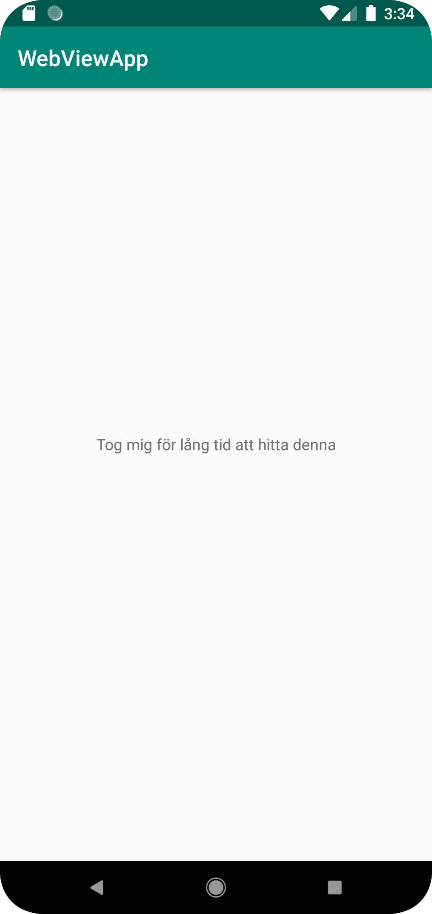

# Rapport

I denna uppgiften skapade jag ett githubkonto med användarnamn "a21henhe". Jag forkade repot "mobileapp-programming-hello"
från användaren "LenaSYS". Sedan skapade jag ett nytt projekt i Android Studio via File->New->Project from Version control och klistrade
in urlen till mitt egna githubrepo. Sedan letade jag förbrilt efter textsträngen där det stod "Hello World!" och ändrade detta till något unikt.
Nästa steg var att jag sparade, addade till git, commitade och pushade upp till mitt egna gitrepo. Sista delen i uppgiften var att skriva denna rapport.

Den kodsträng som ändrats är följande attribut inuti TextView-taggen i app/src/main/res/layout/content_main.xml   :

`<TextView android:text="Tog mig för lång tid att hitta denna" />`

a21henhe
Henric Hemmander
